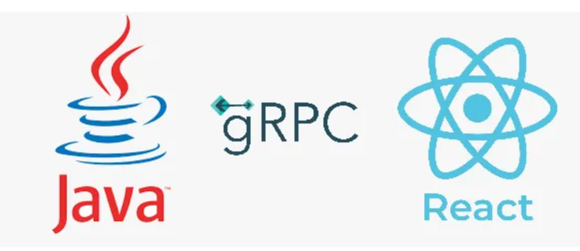

## Introduction

The assignment asks you to do some simple things. The obvious implementation should be easy for you. What we're interested in seeing is what you know from experience to be not so obvious.

Imagine this has to run in production.

What, besides the obvious, do you believe is necessary? Please code it that way :-)

There are 2 parts to the assignment:

Some code to be written.
Some questions about your code.
Tech choices
Please implement the stories below, including a few tests for the back-end, in one of the following languages:

Back-end: gRPC, using Kotlin, Go.
Front-end: gRPC, React.
UI
You are free to design your own UI.

Or you can use this design: https://www.xdguru.com/cars-classified-website-xd-template/

Zeplin: https://scene.zeplin.io/project/5ef21a1a1d1ad329c5f66a27

Assessment
We "grade" based on the following criteria:

Did you implement according to the requirements?
Readability is important to us.
We look at your git commit log. It would be good if it shows us your process.
Understanding your tactical decisions should be made clear.
Coding Part
As a car dealer, I want to browse the cars I have in stock and give purchase recommendations tailored to the needs of my customers.
More specifically,

As a car dealer, I want to search for cars by year and make.
Example:

Given the year 2018, I should get the Citroen C3 and Honda Fit.
Given the brand Citroën, I should get the Citroen C3 2018.
Leaving the search string blank should return a list of all cars.
As a car dealer, I want to be able to add new cars to my store.
Example:

I will enter the car's model, make, version, year of release, price, fuel consumption, and annual maintenance cost. The car will show up in the results returned by story #1.
As a car dealer, I want to recommend to my clients the car with the lowest total annual cost over a period of four (4) years, given the price of fuel (€/L) and the expected distance to travel each month (km/month).
Relevant car parameters are price of the car (€), fuel consumption (km/l), and annual maintenance cost.

Example:

Given that I expect to travel 250 km each month for the next 4 years, and the expected price of fuel is 0.66 €/L, what is the ranking of cars according to their total annual cost?
Questions
Based on these stories, please do as follows:

Describe the architecture you will use and include a motivation of your choices. (max 500 characters)

You have a team of 3 developers. How would you tackle working together on the stories?

Can you describe 1 thing that can go wrong with your code once in production?

All these requirements needs to be satisfied:

1. It must be a REST application implemented using Java (use a framework of your choice)
2. Your code should be production-ready.
3. REST API must be documented
4. Data must be persisted in a database
5. Unit tests must be present
6. Integration tests must be present

-----------------------------------------

## Setup guide

#### Minimum Requirements

- Java 11
- Maven 3.x
- 
-----------------------------------------
## Architecture
The project has four sub-modules. These sub modules are; car-server, car-client, proto-service and react-grpc.

Repository pattern has been used for the car-server service. Hibernate, JPA Data, Spring Boot, h2-database and lombok used for the project.
The car-server service is a GrpcService and it has 3 gprc service; saveCar , searchCar and searchLowestTotalAnnualCost. saveCar endpoint gets a request and this request saves Car table in h2 db. searchCar end-point has 2 parameter and it search Car table wiht these 2 paramater with use Spring Data ,Specification. You can make your calls with grpc unary and grpc-message uses for communication.

The car-client service has a controller layer and 2 endpoints and you can make your call with Json message.

The proto-service has car.proto and gRPC can use protocol buffers. With this car.proto client and server code have generated. 

The react-grpc has a simple ui screens and it makes call to grpc server with react.

gRPC uses HTTP/2 instead of HTTP/1 and  that our React app trys to send a simple HTTP/1 request to our java service that’s why it is complaining about it. The react app is trying to access directly to the java service via the port 9898.  The react is trying to call directly our java service via port 9898, and to solve this we need a proxy in the middle between the two services that is going to convert the HTTP/1 requests into HTTP/2, and for this we will use Envoy with port 8080.